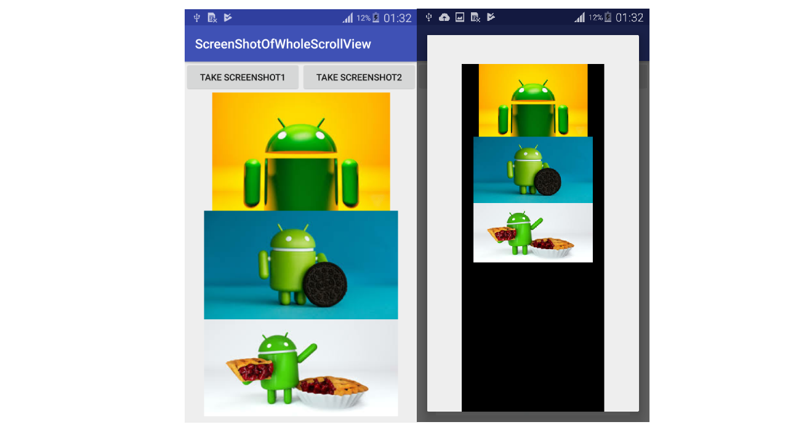

# ScreenShotOfWholeScrollView
Take Screenshot of Whole ScrollView in Android Programmatically 
In your mobile application, you take only appear part of scrollview content when you use getBackground() method.
Disappear part is return null from getBackground() method and it is filled which color you set. In this example, we can take screenshot
with 2 ways. In first way, we implemented this code;
```
Bitmap bitmap = Bitmap.createBitmap(sv_take_ss.getChildAt(0).getWidth(), sv_take_ss.getChildAt(0).getHeight(), Bitmap.Config.ARGB_8888);
Canvas canvas = new Canvas(bitmap);
Drawable bgDrawable = sv_take_ss.getBackground();
if (bgDrawable != null)
    bgDrawable.draw(canvas);
else
    canvas.drawColor(Color.BLACK);
sv_take_ss.draw(canvas);
```
According to this code, disappear part returns BLACK. It means, there are some part that are not shown in screen fill BLACK as you
can see below screenshots. In MainActivity, there are 5 images. But only 3 images are shown in MainActivity, when we click
TAKE SCREENSHOT1 button. In dialog, in addition to these 3 images, rest area is BLACK because of below situation.
```
canvas.drawColor(Color.BLACK);
```



To exceed this problem, we implemented as below;
```
Bitmap bitmap = Bitmap.createBitmap(sv_take_ss.getChildAt(0).getWidth(), sv_take_ss.getChildAt(0).getHeight(), Bitmap.Config.ARGB_8888);
Canvas canvas = new Canvas(bitmap);
ll_take_ss.draw(canvas);
```
Now, dialog's content changed, when we clicked TAKE SCREENSHOT2 button;


